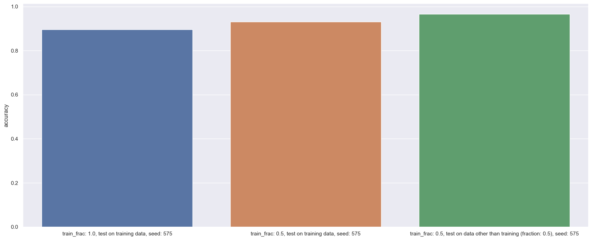
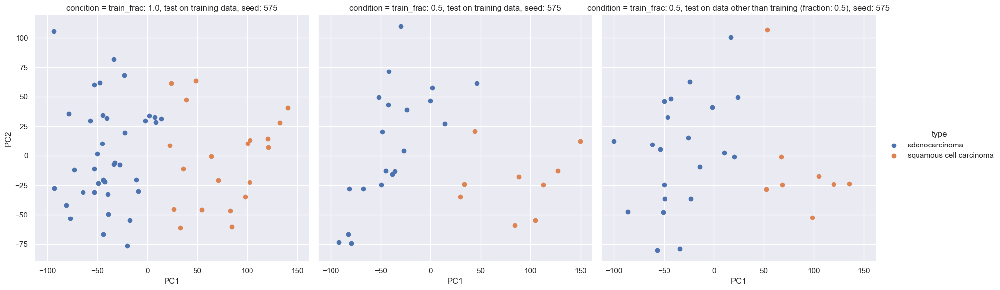

# Lung_cancer_subtyping


## Description of the project
The goal of this class project is to build and evaluate a mathematical model that can discriminate between two lung cancer subtypes.
To build the model we use an unsupervised k-means clustering algorithm (Euclidean distance) of 58 NSCLC tumors using k=2.
To evaluate the model we compute the model accuracy. Accuracy in this case is the percentage of samples that the model assigns to the wrong subtype outof all the samples it classifies. </br>


## Data
The data contains 40 adenocarcinoma (AD) samples and 18 squamous cell carcinoma (SCC) samples.

The data is available in the SOFT formatted family file available under the Download header at the following link.
https://www.ncbi.nlm.nih.gov/geo/query/acc.cgi?acc=GSE10245 </br>
The SOFT formatted gz file is also available in the data folder of this repository.

## Packages
All packages used in this project are in the Python language.
The packages used in this project are:
- pandas
- sklearn
- GEOparse 
- skelearn
- matplotlib
- seaborn

The GEOparse package is used to parse the SOFT formatted file and extract the data.  
The sklearn package is used to perform the k-means clustering algorithm.  
The matplotlib and seaborn packages are used to plot the data and the results.  
The pandas package is used to manipulate the data.  

### How to install the packages
The following code will install the packages and their dependencies:
```cmd
git clone https://github.com/QuanEvans/Lung_cancer_subtyping.git
cd Lung_cancer_subtyping/python/gse_tools
pip install .
```


## Features
- Parse the SOFT formatted file and extract the data
- Perform the k-means clustering algorithm
- Compute the model accuracy and archive the results
- Plot the results (bar plot accuracy and scatter plot of the clustering results)

</br>

## How to run the code
The code is written in Python language.
The code is available in the python folder of this repository.
We suggest running the code in a Jupyter notebook.
The following are example of how to run the code:
```python
from gse_tools.GSEs import GSEs # or import GSEs if you install the package
filepath="./../data/GSE10245_family.soft.gz"
gse = GSEs(file_path=filepath) # create an instance of the GSEs class

gse.set_seed(575) # set the seed for the random number generator
# note the predict would automatically archive the results and the trian_model would automatically reset all the parameters
# the follow are three example of the training using different subset of the data
gse.train_model(n_clusters=2,train_frac=0.5).predict(testOnTrain=True).accuracy # get the model accuracy
gse.train_model(n_clusters=2,train_frac=0.5).predict(testOnTrain=True).accuracy
gse.train_model(n_clusters=2, train_frac=0.5).predict().accuracy

# the Datafrane of the sample lable; cluster number; and the subtype (AD or SCC) can be accessed using the following attributes
gse.accuracy_matrix
```
The bar plot of the model accuracy can be plotted using the following code:
```python
gse.plot_accuracy()
```


</br>

The scatter plot of the clustering results (pca) can be plotted using the following code:
```python
gse.plot_cluster()
```

